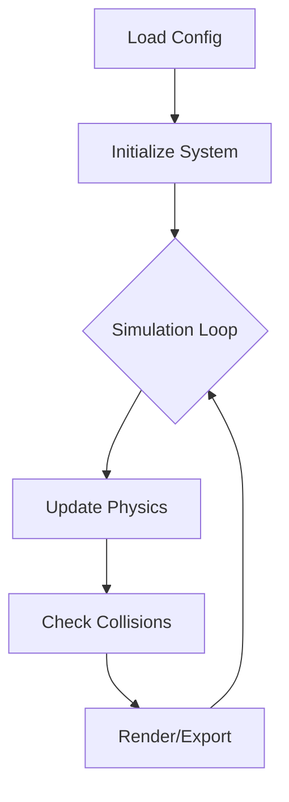

# BallSim: Physics Playground for Balls
[](https://benbrandt14.github.io/BallSim.jl/dev/)
[](https://benbrandt14.github.io/BallSim.jl/stable/)
[](https://github.com/JuliaTesting/Aqua.jl)

**Status:** Freshly Vibed Trash | **Core:** Julia 1.10+ | **Rendering:** Makie




# BallSim.jl

A high-performance, multi-threaded 2D and 3D physics engine written in Julia. Designed for massive particle simulations ($N > 10^6$) with a decoupled rendering pipeline capable of 8K visualizations.

Inspired by [the work of Alexander Gustafsson](https://www.youtube.com/watch?v=VJn2cHscTUM)

## Features

* **Performance:** Structure-of-Arrays (SoA) data layout with multi-threaded physics kernels.
* **Modular Architecture:** Physics, Geometry, and Rendering are strictly decoupled.
* **Declarative Configuration:** Full simulation control via YAML files (solvers, fields, boundaries).
* **"Darkroom" Rendering:** Headless HDF5 export pipeline with a separate high-res rendering tool (supports Logarithmic Tone Mapping).
* **3D Support:** Full 3D simulation capabilities with configurable 2D visualization projection (XY, XZ, YZ) and "Depth" visualization mode.
* **Extensible:** Easy interfaces for defining new Shapes, Force Fields, and Scenarios.

## Installation

```bash
git clone https://github.com/benbrandt14/BallSim
cd BallSim
# Option 1: Quick Start (Installs Julia if needed, instantiates, and tests)
./setup.sh

# Option 2: Manual Setup
julia --project=. -e 'using Pkg; Pkg.instantiate()'
```

## Usage

### 1. Command Line

You can use the provided `Makefile` for convenience:

```bash
make run-render       # Runs headless simulation
make run-interactive  # Runs interactive simulation with GLMakie
make run-export       # Runs simulation and exports to HDF5
```

Or run directly with Julia:

```bash
julia --project=. sim.jl
```

Or specify a custom configuration file:

```bash
julia --project=. sim.jl my_config.yaml
```

**Configuration Structure (`config.yaml`):**

```yaml
simulation:
  type: Spiral
  params:
    N: 50000
  duration: 10.0
  dimensions: 3
physics:
  dt: 0.002
  solver: CCD
  solver_params:
    restitution: 0.5
    substeps: 8
  gravity:
    type: Central
    params:
      strength: 20.0
      mode: attractor
      center: [0.0, 0.0, 0.0]
  boundary:
    type: Circle
    params:
      radius: 1.0

# Example 3D Box (Requires dimensions: 3)
# boundary:
#   type: Box
#   params:
#     width: 10.0
#     height: 10.0
#     depth: 10.0

output:
  mode: render
  res: 800
  fps: 60
  filename: sandbox/simulation
  projection: xy
  visualization:
    mode: depth
    aggregation: max
```

### 2. The Darkroom (High-Res Visualization)

Turn raw HDF5 data into art using the standalone renderer tool.

```bash
# Usage: julia tools/render_frame.jl <h5_file> <frame_index>
julia --project=. tools/render_frame.jl sandbox/data_123456.h5 10

```

* **Output:** A 4K (3840x2160) PNG with logarithmic tone mapping.
* **Performance:** Multi-threaded accumulation buffer; renders 1M particles in milliseconds.

### 3. ParaView Export (VTK)

Export simulations directly to `.vtu` (Unstructured Grid) or `.vtp` (PolyData) formats for analysis in ParaView.

**Configuration:**
Set `mode` to `"export"` and use a filename with `.vtu` or `.vtp` extension.

```yaml
output:
  mode: export
  filename: sandbox/simulation.vtu
  fps: 60
```

**Features:**
*   **Data Fields:** Exports Position, Velocity, Mass, Active status, and Collision counts.
*   **Time Series:** Generates a sequence of files (e.g., `simulation_00001.vtu`) automatically recognized by ParaView as a time series.

## Extension Guide

BallSim is built on a "Plugin" architecture. You can extend it without modifying the core loop.

### 1. Adding a New Scenario

Create a struct that subtypes `Common.AbstractScenario{D}`.

```julia
# src/Scenarios.jl

struct GalaxyScenario <: Common.AbstractScenario{2}
    N::Int
end

# A. Define Initial Conditions
function Scenarios.initialize!(sys::Common.BallSystem{2, T, S}, scen::GalaxyScenario) where {T, S}
    # Initialize sys.data.pos and sys.data.vel here...
end

# B. Define Physics Rules (Solver Config)
function Common.get_default_solver(scen::GalaxyScenario)
    return Physics.CCDSolver(0.001f0, 1.0f0, 8)
end

# C. Define Forces
function Common.get_force_field(scen::GalaxyScenario)
    # Combine Gravity and Drag
    g = Fields.CentralField(SVector(0f0, 0f0), 100.0f0)
    d = Fields.ViscousDrag(0.1f0)
    return Fields.CombinedField((g, d))
end

```

### 2. Adding a New Shape

Create a struct that subtypes `Common.AbstractBoundary{D}`.

```julia
# src/Shapes.jl

struct Triangle <: Common.AbstractBoundary{2}
    p1::SVector{2, Float32}
    p2::SVector{2, Float32}
    p3::SVector{2, Float32}
end

# A. Signed Distance Function
function Common.sdf(b::Triangle, p::SVector{2}, t)
    # Return distance (Negative = Inside, Positive = Outside)
end

# B. Normal Vector
function Common.normal(b::Triangle, p::SVector{2}, t)
    # Return normalized vector pointing OUT of the shape
end

```

### 3. Adding a New Force Field

Create a struct that subtypes `Fields.AbstractField`.

```julia
# src/Fields.jl

struct MagneticField <: Fields.AbstractField
    strength::Float32
end

# Implement the Functor
function (f::MagneticField)(p, v, t)
    # Return Force Vector F = q(v x B) ...
    return SVector(...) 
end

```

## Testing

I told Gemini to use a TDD workflow.

* **Unit Tests:** `julia --project=. -e 'using Pkg; Pkg.test()'`
* **Hygiene:** `Aqua.jl` ensures no method ambiguities or stale dependencies.

See `AGENTS.md` for more detailed workflow instructions and coding standards.

## Project Structure

```text
src/
├── BallSim.jl       # Main entry point & dependency loader
├── Common.jl        # Core Types (BallSystem) & Interfaces
├── Config.jl        # YAML Configuration Factory
├── Physics.jl       # Solvers (CCDSolver) & Integration Kernels
├── Shapes.jl        # Geometry (SDFs for Circle, Box, Ellipsoid)
├── Fields.jl        # Force Fields (Gravity, Drag, Central)
├── Scenarios.jl     # Recipes (Spiral, Galaxy, etc.)
├── Vis.jl           # Real-time Visualization logic
└── SimIO.jl         # HDF5 Input/Output

ext/
└── BallSimInteractiveExt.jl # GLMakie extension for interactive mode

docs/                # Documentation source (Documenter.jl)
tools/
└── render_frame.jl  # Standalone High-Res Renderer

Makefile             # Build and Run targets
setup.sh             # Setup script
sim.jl               # CLI Entry point
```
